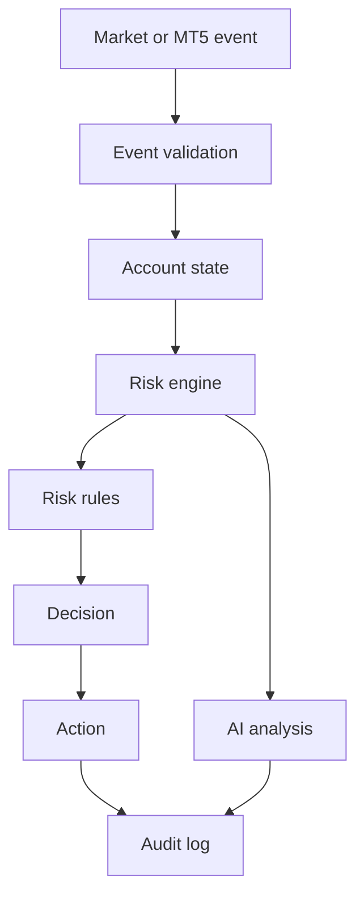
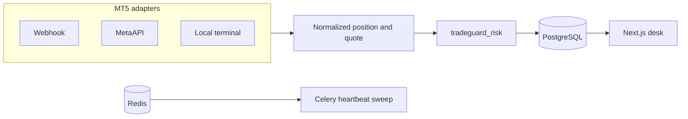

# Architecture

TradeGuard is a risk desk. The deterministic engine decides ALLOW, WARNING, BLOCK, or EMERGENCY_STOP. AI sits beside that path and cannot change a limit or skip a check.

The risk package has no database or network calls. The API normalizes broker payloads, loads account state, and calls `evaluate_fail_closed`. A raised exception becomes BLOCK with code ENGINE_FAILURE.

Copy monitoring is optional. A master fill that the engine allows or warns on is re-checked against each follower. A follower BLOCK or EMERGENCY_STOP is stored and is not queued for execution.
